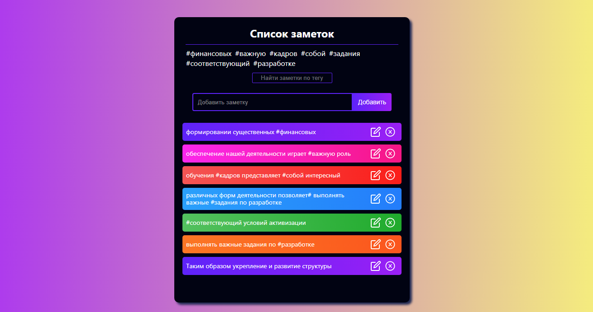
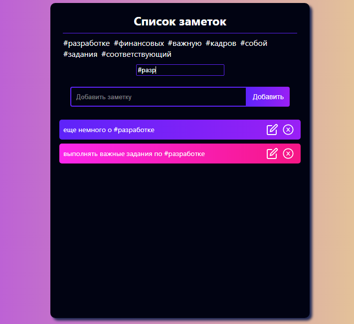
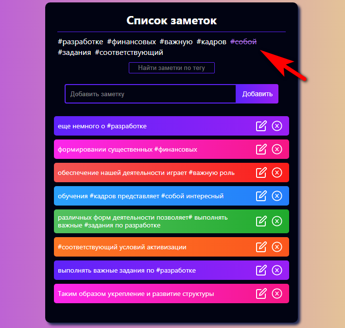

<h1 align="center">TODO-list</h1>

</br>



</br>

## Description

#### This app is a todo list with the ability to add tags

</br>

---

### <p align="center"><a  href="https://gracious-torvalds-890dc4.netlify.app/">Live Demo</a></p>

---

</br>

## Features

- #### Create, edit, view and delete notes

- #### Filter notes by tag



- #### Removing a tag from the list by clicking on it



- #### While creating or editing a note, the user can create tags using **#**

</br>

## Tech

#### Powered by **React** with using **SCSS**

</br>

## Setup and Launch

```
git clone https://github.com/guryanov-junior/TODO-list.git

#install the project dependencies
$ npm install

# watches your files and uses livereload by default
$ npm start
```

</br>
